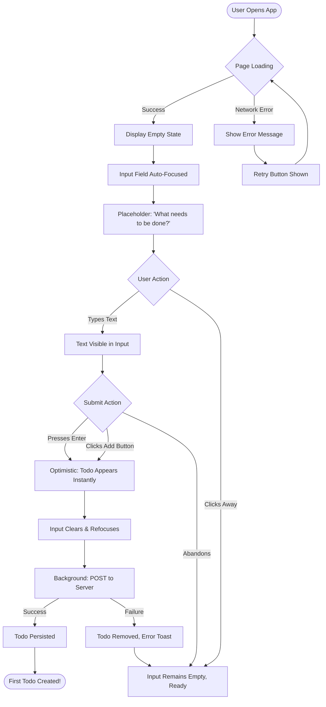
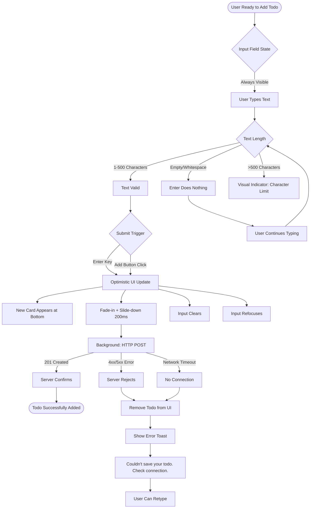
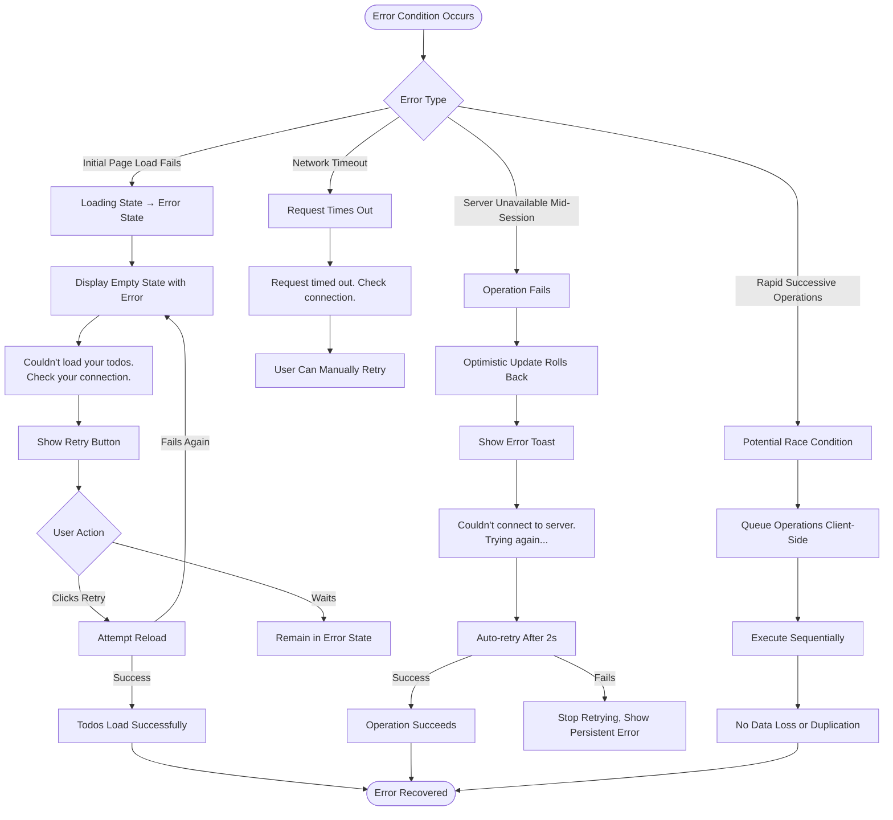

# UX Design Specification trainingnf

**Author:** Nearformer
**Date:** 2026-04-16

---

## Executive Summary

### Project Vision

A deliberately minimal full-stack Todo application that serves as a BMAD Method learning exercise. The UX goal is to take the most familiar pattern in web development and make it feel complete — not a demo, not a prototype, but a small product that needs zero explanation. The app should feel finished and polished despite its intentionally narrow feature set. Success means any user can add, complete, and delete a todo within 30 seconds of opening the app with no instructions needed.

### Target Users

**Alex** — a casual user who wants a dead-simple way to track daily tasks. Not looking for project management, prioritization, or collaboration. Just a list. Tech comfort level is average — they use web apps daily but don't think about how they work. They'll use this on both desktop and mobile, in short bursts throughout the day. The app needs to be invisible as a tool: open, do the thing, close.

### Key Design Challenges

1. **Making "simple" feel "finished"** — Every state (empty, loading, error, populated) must feel intentional and polished, not like a tutorial project afterthought
2. **Optimistic UI without deception** — Instant feedback with graceful rollback on failure; delete without confirmation dialogs must feel confident, not reckless
3. **Responsive with minimal surface area** — A single-screen, few-element UI must feel native and comfortable on both desktop and mobile without awkward spacing

### Design Opportunities

1. **Micro-interactions as polish signal** — Subtle animations on toggle, add, delete, and state transitions can make the app feel crafted with minimal implementation cost
2. **Zero-friction first experience** — The empty state IS the onboarding; pure visual clarity delivers the "productive in 30 seconds" success criterion
3. **Accessibility as a design feature** — With few interactive elements, keyboard navigation and screen reader support can feel first-class rather than bolted on, enhancing the experience for all users

## Core User Experience

### Defining Experience

The core experience is a tight loop: **open → manage tasks → close**. The product's value is delivered in seconds, not minutes. The defining interaction is adding a todo — type text, hit Enter, see it appear instantly. If this moment feels snappy and trustworthy, the user's confidence in the entire app is established. Everything else (toggle, delete, returning to a persisted list) reinforces that initial trust.

The most frequent action is toggling completion — the satisfaction of checking things off. The most critical action is creation — it's the first thing every user does and sets the tone for the entire experience.

### Platform Strategy

- **Primary platform:** Web SPA, responsive design
- **Desktop:** Mouse and keyboard primary input; Enter key submits, Tab navigates, focused centered layout
- **Mobile:** Touch primary input; appropriately sized tap targets (minimum 44px), comfortable thumb-reachable interactions
- **Breakpoint strategy:** Mobile-first, single breakpoint at 768px
- **Offline:** Not required for MVP — app expects network connectivity
- **Device capabilities:** No device-specific features needed; standard browser APIs only

### Effortless Interactions

These interactions must feel like they require zero cognitive effort:

| Interaction | How It Should Feel |
|---|---|
| Add a todo | Type → Enter. No button hunting, no mode switching. The input is always visible and ready. |
| Complete a todo | One tap/click on checkbox. Visual change is immediate and satisfying. |
| Delete a todo | One action, no confirmation dialog. Feels confident because the stakes are low (it's a todo, not a bank transfer). |
| Return to app | Open browser → todos are there. No login, no loading spinner that lingers. Data persistence is invisible. |

### Critical Success Moments

1. **First todo created** — The user types something, hits Enter, and sees it appear instantly. This is the "it just works" moment that establishes trust.
2. **First todo completed** — The checkbox toggle with clear visual feedback (strikethrough, fade, color change) delivers the core satisfaction of a task list.
3. **Returning to a persisted list** — Opening the app and seeing yesterday's todos confirms reliability without the user having to think about storage.
4. **Graceful error handling** — When something goes wrong (network down, server error), the app communicates clearly instead of breaking silently. Trust is maintained even in failure.

### Experience Principles

1. **Instant trust** — Every interaction confirms the app works. Add a todo, it appears. Check it off, it changes. Come back tomorrow, it's all there. No surprises.
2. **Self-evident interface** — If a user has to wonder "how do I…?", the design has failed. Every action should be visually obvious without labels, tooltips, or instructions.
3. **Speed is a feature** — Optimistic UI isn't a technical choice, it's a UX commitment. The app should feel faster than the network. Perceived latency is zero.
4. **Polish over features** — With only four actions (add, view, toggle, delete), every pixel and transition matters. The small surface area means quality is visible everywhere.

## Desired Emotional Response

### Primary Emotional Goals

**Calm competence** — the feeling of a tool that respects your time and intelligence. Not excitement, not "wow" delight — the quiet satisfaction of something that works exactly as expected. The closest analogy: a well-designed light switch. You don't think about it. It just does the thing.

The product should feel invisible as a tool. Users open it, manage their tasks, and move on with their day. The emotional signature is reliability and effortlessness, not novelty.

### Emotional Journey Mapping

| Stage | Desired Feeling | What Creates It |
|---|---|---|
| First open (empty state) | Welcoming, not barren | A clear input field with friendly empty state — "ready when you are" energy, not "you have nothing" |
| First todo added | Satisfaction, trust | Instant appearance with smooth animation — the "this works" moment that establishes confidence |
| Managing tasks | Flow, efficiency | No friction between actions. Check, delete, add — each feels like a single thought, not a multi-step process |
| Completing a todo | Small accomplishment | Visual feedback that says "done" with just enough flourish to feel rewarding without being theatrical |
| Error state | Reassurance, not alarm | Clear communication, no panic, no data lost — "we'll get this sorted" energy |
| Returning to the app | Reliability, comfort | Everything is where you left it. Zero re-orientation needed. Trust confirmed silently. |

### Micro-Emotions

**Emotions to cultivate:**

- **Confidence over confusion** — The user never wonders what to do next. This is the single most critical emotional state. Every element's purpose is self-evident.
- **Trust over skepticism** — Data persists, actions work, errors are handled. The app earns trust through consistent, predictable behavior across every interaction.
- **Satisfaction over delight** — We're not trying to surprise anyone. We're delivering exactly what's expected, perfectly executed. The reward is in the reliability.

**Emotions to prevent:**

- **Anxiety** — "Did my data save?" should never cross the user's mind. Optimistic UI and persistent storage make this invisible.
- **Frustration** — No dead ends, no unclear states, no broken layouts. Every path leads somewhere sensible.
- **Overwhelm** — Maintained by keeping the feature set ruthlessly minimal. The interface never asks the user to make unnecessary decisions.

### Design Implications

| Emotional Goal | UX Design Approach |
|---|---|
| Calm competence | Clean layout, generous whitespace, no visual clutter. Neutral color palette with purposeful accent colors only for interactive elements and state changes. |
| Confidence | Self-evident affordances — checkboxes look clickable, input fields look typeable, delete controls are discoverable but not distracting. No hidden gestures or non-obvious interactions. |
| Trust | Optimistic UI with graceful rollback. Consistent behavior across all actions. Error states that communicate clearly without alarming. |
| Satisfaction | Subtle micro-animations on state changes (add, complete, delete) that provide tactile feedback. Not flashy — just enough to confirm "your action was received." |
| Reassurance (in errors) | Friendly, human error messages. No technical jargon. Clear indication of what happened and that data is safe. |

### Emotional Design Principles

1. **Invisible when working** — The best emotional response is no emotional response. When everything works, the user thinks about their tasks, not the app.
2. **Honest feedback** — Every action gets a visual response. Every error gets a clear explanation. The app never leaves the user guessing.
3. **Earned trust, not assumed** — Trust is built interaction by interaction. Persistence, speed, and graceful error handling are trust deposits. Each one compounds.
4. **Restraint is respect** — No celebratory confetti for completing a todo. No gamification. No engagement tricks. Restraint in design signals respect for the user's time and intelligence.

## UX Pattern Analysis & Inspiration

### Inspiring Products Analysis

We analyzed four products that exemplify the "calm competence" and "invisible tool" qualities we're targeting:

**Things 3 (Todo App)**
- Empty state mastery — welcoming, input-first interface on first launch
- Checkbox polish — subtle completion animation, tactile without theatricality
- Keyboard-first with touch-second design on mobile
- Visual restraint — neutral palette, generous whitespace, one accent color

**Linear (Issue Tracker)**
- Speed as a feature — optimistic UI makes every action feel instant
- Honest feedback — specific, actionable error messages
- Micro-interactions at scale — coordinated hover, focus, and transition system
- Command palette — keyboard power users never need the mouse

**Google Keep (Notes/Lists)**
- Zero onboarding — land on page, input field visible, start typing immediately
- Touch-optimized — large tap targets, natural swipe gestures
- Persistence without ceremony — auto-save is invisible
- Resilient to content — layout adapts to varying text lengths gracefully

**Apple Reminders (iOS/Mac)**
- Platform convention adherence — feels like part of the OS
- Checkbox perfection — circular checkbox with satisfying bounce animation
- Swipe to delete on mobile — clear affordance, no confirmation needed
- Clear completed state — fade without hiding, preserving sense of accomplishment

### Transferable UX Patterns

| Pattern | Source | Application to trainingnf |
|---|---|---|
| Welcoming empty state | Things 3 | Show input field + friendly prompt "What needs to be done?" — not "No todos yet" |
| Optimistic UI everywhere | Linear | Add, toggle, delete reflect instantly. Server sync happens silently. |
| Enter to submit | Things 3, Keep | Primary action is Enter key on input. "Add" button optional for discoverability. |
| Subtle checkbox animation | Things 3, Reminders | ~150ms scale + strikethrough on toggle. Tactile but not distracting. |
| Keyboard navigation | Linear, Things 3 | Tab through elements, Enter toggles, keyboard delete action. |
| Mobile swipe gestures | Reminders | Swipe left on todo reveals delete (touch devices only). |
| Fade completed items | Reminders | Completed todos visible but ~60% opacity, preserving accomplishment sense. |
| Clear error messages | Linear | Specific, human messages: "Couldn't connect. Trying again..." |

### Anti-Patterns to Avoid

| Anti-Pattern | Why Avoid | Alternative Approach |
|---|---|---|
| Confirmation dialogs for delete | Breaks flow, implies user error | One-action delete, stakes are low (just a todo) |
| Tooltip overload | Signals poor affordance design | Make actions self-evident through visual design |
| Generic error messages | "Error occurred" tells user nothing | Name the problem: "Couldn't save. Check your connection." |
| Loading spinners that linger | Creates perceived latency | Optimistic UI + background sync, show loading only initially |
| Feature discovery tours | Admission UI isn't intuitive | Design where every action is visually obvious |
| Celebratory animations | Feels patronizing for basic tasks | Animation for state feedback only, not reward/gamification |

### Design Inspiration Strategy

**Adopt Directly:**
- Empty state pattern (Things 3) — welcoming, input-first layout
- Optimistic UI (Linear) — instant updates, silent background sync
- Checkbox animation (Things 3/Reminders) — subtle, satisfying toggle
- Keyboard-first interaction (Linear/Things 3) — Enter submits, Tab navigates, visible focus

**Adapt for Context:**
- Command palette principle (Linear) — too heavy for single-screen app, but keyboard nav for power users applies
- Swipe to delete (Reminders) — mobile/touch only; desktop needs visible delete control
- Completed item fade (Reminders) — visual distinction without hiding completed items

**Explicitly Avoid:**
- Onboarding flows — interface should need zero explanation
- Confirmation dialogs — breaks the "fast tool" promise
- Feature creep from sources — tags, priorities, due dates all post-MVP
- Over-animation — emotional goal is calm, not excitement

**Unique to trainingnf:**
- Web-first (not native) — lean on standard HTML/CSS, don't fake native controls
- Single-user, no auth — 100% focus on task UX, zero account/login cognitive load
- BMAD learning context — app should be study-able, code clarity matters

## Design System Foundation

### Design System Choice

**Tailwind CSS** — utility-first CSS framework

Tailwind provides a comprehensive set of low-level utility classes that compose to build custom designs. Unlike component libraries (Material, Bootstrap) that impose visual opinions, Tailwind gives us full control over styling while maintaining consistency through its design token system.

### Rationale for Selection

**Why Tailwind is ideal for trainingnf:**

1. **Study-able code** — Design decisions are explicit in the markup. A developer reading the code can see exactly how each element is styled without hunting through separate CSS files. This aligns perfectly with the BMAD learning goal.

2. **Speed without abstraction** — No need to learn a component API or fight opinionated defaults. You write utility classes and the design emerges. Development is fast but the decisions remain visible.

3. **Small bundle size** — Tailwind's purge/tree-shake process means the production bundle only includes utilities actually used. For a minimal app like this, we're looking at <10KB of CSS.

4. **Design token system built-in** — Spacing scale, color palette, breakpoints, transitions — all predefined and consistent. We customize the tokens once in config, use them everywhere.

5. **No "Tailwind look"** — Unlike Material or Bootstrap, Tailwind doesn't impose visual patterns. Our app won't look like every other Tailwind app because utility classes are compositional, not prescriptive.

6. **Responsive and accessibility utilities** — Built-in responsive prefixes (`md:`, `lg:`) and accessibility utilities (`sr-only`, `focus-visible:`) align with our platform strategy and accessibility requirements.

**Why not alternatives:**

- **Custom CSS** — Too time-intensive for a days-not-weeks timeline. We'd spend time writing margin utilities instead of building features.
- **Component libraries (MUI, Chakra)** — Abstract design decisions behind component props. Less study-able. Larger bundles. Risk of looking generic.
- **Bootstrap/Material** — Strong visual opinions would dominate our "calm competence" aesthetic. Harder to achieve the restraint we're targeting.

### Implementation Approach

**Setup:**

- Install Tailwind CSS via npm
- Configure `tailwind.config.js` with custom design tokens
- Set up PostCSS for build process
- Enable JIT (Just-In-Time) mode for development speed

**Integration with React:**

- Utility classes applied directly to JSX elements
- No CSS modules or styled-components needed
- Component logic and styling co-located for readability

**Development workflow:**

- Design tokens defined once in config (colors, spacing, typography)
- Utilities composed in components to create desired designs
- Tailwind IntelliSense VSCode extension for autocomplete
- Production build automatically purges unused utilities

### Customization Strategy

**Design tokens to customize in `tailwind.config.js`:**

**Color palette:**
- Neutral grays for primary UI (slate or zinc family)
- Single accent color for interactive elements (blue, green, or purple)
- Semantic colors: success (green), error (red), warning (amber)
- Opacity variants for completed todo state (~60% fade)

**Typography:**
- System font stack: `-apple-system, BlinkMacSystemFont, "Segoe UI", Roboto, sans-serif`
- Single font size for todo text (~16px base)
- Line height optimized for readability (1.5)
- Font weight: regular (400) for body, medium (500) for emphasis

**Spacing scale:**
- Use Tailwind's default spacing scale (4px base unit)
- Generous padding/margin for calm, spacious layout
- Consistent spacing between todos, around input field

**Transitions:**
- Custom timing for checkbox animation (~150ms)
- Easing function for tactile feel (ease-in-out)
- Fade transitions for completed items

**Breakpoints:**
- Single breakpoint at 768px (mobile-first)
- `md:` prefix for desktop-specific styles
- Touch target sizes adjust at breakpoint (44px minimum on mobile)

**Component patterns to establish:**

- **Input field styling** — clean border, clear focus state, generous padding
- **Checkbox visual** — custom styled to replace default HTML checkbox
- **Todo list item** — consistent spacing, clear hover/focus states
- **Delete button** — visible on desktop (hover), revealed on mobile (swipe/tap)
- **Empty/error/loading states** — typography and spacing patterns

**Custom utilities to add (if needed):**
- Strikethrough animation with fade
- Swipe gesture indicators (mobile)
- Focus ring styles matching brand

**Accessibility considerations:**
- Use Tailwind's `focus-visible:` utility for keyboard focus
- Ensure 4.5:1 contrast ratio with color choices
- Screen reader classes (`sr-only`) for context where needed

## Core User Experience (Detailed)

### Defining Experience

**"Type → Enter → See it appear"** — The first todo creation is the defining experience for trainingnf.

This is the moment when the user types text into the input field and hits Enter, and the todo instantly appears in the list. If we nail this interaction — making it feel snappy, reliable, and effortless — the user trusts the entire app. Everything else (toggle completion, delete, returning to a persisted list) builds on this initial trust.

The add-todo flow is the most frequent user interaction and the first one every new user experiences. It sets expectations for the entire product: speed, clarity, and reliability.

### User Mental Model

Users approach task management with specific expectations shaped by decades of list-making:

**Physical list substitute:** They're replacing pen and paper or mental tracking. The expectation is zero friction between thought and capture. The digital tool should be faster than paper, not slower.

**Immediate permanence:** When writing something down, it's *there*. No "saving" step, no loading indicator that makes them wait. The act of entry is the act of persistence.

**Platform-specific expectations:**
- **Desktop:** Keyboard flow. Type → Enter → type next. Mouse is for pointing, not mandatory actions.
- **Mobile:** One-handed operation. Thumb-reachable inputs. Software keyboard submit buttons work as expected.

**Existing solution pain points:**
- Having to click "Add" after typing breaks typing flow
- Loading indicators create perceived latency even when server is fast
- Unclear feedback leaves users wondering "did it save?"
- Cluttered interfaces hide the input field

### Success Criteria

The add-todo interaction succeeds when these criteria are met:

| Criterion | Target | Why It Matters |
|---|---|---|
| Perceived latency | < 100ms | User perceives action as instant. Trust established. |
| Input field visibility | Always visible, top of screen | No hunting. Ready when user has a thought. |
| Keyboard completion | Enter submits on desktop | Flow is uninterrupted. Feels native to desktop users. |
| Tactile feedback | Subtle animation (~200ms) | Confirms "this happened" without theatricality. |
| Ready for next action | Input clears and refocuses | Supports rapid entry of multiple todos. |
| Validation invisibility | Blank submit does nothing | No error messages for expected behavior. |

### Novel vs. Established Patterns

**Pattern classification: 100% established**

The add-todo interaction uses universally understood patterns:
- Text input → submit action → item added to list
- This is the pattern of forms, search boxes, messaging apps
- Users understand it implicitly — no learning curve

**We are NOT innovating here.** Novel patterns would hurt us. What we're doing instead:

**Perfecting the familiar:**
- Removing friction (no mandatory button click)
- Eliminating perceived latency (optimistic UI)
- Providing honest, immediate feedback (animation + cleared input)

**Our edge:** Making the established pattern feel *perfect* through execution quality, not novelty.

### Experience Mechanics

**1. Initiation (How it starts):**

| Platform | User Action | Visual State |
|---|---|---|
| Desktop | Page loads, cursor auto-focused in input | Empty field with placeholder "What needs to be done?" |
| Mobile | User taps input field (44px tap target min) | Keyboard appears, field focused |
| Both | Input field always visible at top | Clean border, generous padding, clear affordance |

**2. Interaction (What user does):**

- User types todo text (up to 500 characters, no validation shown)
- **Desktop:** Presses Enter key → submits
- **Mobile:** Presses "Go" / "Done" on keyboard → submits
- **Optional:** "Add" button visible for discoverability, works on click/tap

**3. Feedback (System response):**

| Timing | Action | Purpose |
|---|---|---|
| 0ms | Todo appears at bottom of list | Optimistic UI — instant perception |
| 0-200ms | Fade-in + slight slide animation | Tactile confirmation without theatricality |
| 0ms | Input field clears and refocuses | Ready for next entry immediately |
| Background | HTTP POST to server | Silent persistence — user never waits |
| On failure | Todo removed, error toast shown | Honest feedback if server unavailable |

**4. Completion (How user knows it worked):**

- **Primary signal:** The todo is in the list. Presence = success.
- **Secondary signal:** Input field is empty and ready for next entry.
- **No explicit "success" message** — the outcome is self-evident.

**Next action options:**
- Add another todo (input is immediately ready)
- Toggle completion on the new todo
- Delete the todo
- Close app (data persists)

## Visual Design Foundation

### Color System

**Primary palette: Neutral-first with minimal accent usage**

The color system prioritizes calm and restraint, using a neutral gray scale (Tailwind Slate) as the foundation with a single accent color (Indigo) for interactive elements.

**Neutral scale (Slate):**
- Background: `slate-50` (#f8fafc) — very light, airy page background
- Surface: `white` (#ffffff) — input fields, todo item cards
- Borders: `slate-200` (#e2e8f0) — subtle visual separation
- Text primary: `slate-900` (#0f172a) — high contrast body text (18.07:1 contrast ratio)
- Text secondary: `slate-500` (#64748b) — placeholders, less prominent text
- Completed state: `slate-400` (#94a3b8) — faded but still legible (~60% perceived opacity)

**Accent color (Indigo):**
- Primary: `indigo-600` (#4f46e5) — focus states, primary actions
- Hover: `indigo-700` (#4338ca) — interactive hover feedback
- Focus ring: `indigo-500` with 50% opacity ring

**Semantic colors:**
- Success: `green-600` (#16a34a) — rarely used, persistent confirmations only
- Error: `red-600` (#dc2626) — error messages, failed operations
- Warning: `amber-600` (#d97706) — if needed (unlikely in MVP)

**Rationale:** Neutral-first palette supports "invisible tool" goal. Indigo accent is calm, professional, trustworthy — not aggressive or attention-seeking. All combinations meet WCAG AA (4.5:1 minimum contrast ratio).

### Typography System

**Font stack: System fonts**

```css
font-family: -apple-system, BlinkMacSystemFont, "Segoe UI", Roboto, 
             "Helvetica Neue", Arial, sans-serif;
```

System fonts feel native to each platform, load instantly (no web font request), and are highly readable.

**Type scale:**

| Element | Size | Weight | Line Height | Usage |
|---|---|---|---|---|
| Todo text | 16px (base) | 400 (regular) | 1.5 | Primary content, comfortable on mobile |
| Helper text | 14px (sm) | 400 (regular) | 1.5 | Empty state, error messages |
| Placeholder | 16px (base) | 400 (regular) | 1.2 | Input field placeholder text |

**Font weights:**
- Regular (400): All body text, todos
- Medium (500): Emphasis only if needed (rarely used)

**Rationale:** Minimal type scale matches minimal UI. 16px base is mobile-friendly and accessible. System fonts avoid loading delays and feel native.

### Spacing & Layout Foundation

**Spacing unit: 4px base (Tailwind default)**

**Key spacing values:**

| Context | Spacing | Tailwind Class | Rationale |
|---|---|---|---|
| Between todos | 12px vertical | `py-3` | Comfortable tap targets, visual separation |
| Input padding | 16px all sides | `p-4` | Generous, welcoming entry point |
| Container padding | 24px mobile, 32px desktop | `px-6` / `px-8` | Content breathing room from edges |
| Max content width | 672px | `max-w-2xl` | Centered, doesn't sprawl on wide screens |
| Todo to delete button | 8px | `gap-2` | Comfortable spacing, clear association |

**Layout structure:**
- **Single centered column** — all content in one vertical flow
- **No grid system needed** — single-column list, no complex layouts
- **Generous whitespace** — more breathing room than typical todo apps (reinforces "calm" goal)
- **Centered on desktop** — empty horizontal space on wide screens, focused content area

**Touch target sizing:**
- **Mobile:** Minimum 44px tap targets (checkboxes, delete buttons)
- **Desktop:** Can be smaller (32px) for mouse precision

**Responsive strategy:**
- **Mobile-first** — base styles assume mobile
- **Single breakpoint** at 768px (`md:` prefix)
- **Adjustments at breakpoint:** Increased padding, slightly larger max-width

### Accessibility Considerations

**Visual accessibility:**
- **Contrast ratios:** All text/background combinations meet WCAG AA (4.5:1 minimum)
- **Focus indicators:** Visible 2px `indigo-500` ring on all interactive elements using `focus-visible:`
- **Color is not sole indicator:** Completed todos use strikethrough + color change

**Keyboard accessibility:**
- **Tab order:** Input field → todos (checkboxes) → delete buttons → next todo
- **Focus trap:** None needed (single-page, no modals)
- **Keyboard shortcuts:** Enter submits, Tab navigates, Space toggles checkbox

**Screen reader support:**
- **Semantic HTML:** `<button>`, `<input>`, `<ul>/<li>` elements
- **ARIA labels:** "Delete [todo text]" for delete buttons
- **`sr-only` utility:** Hidden labels where icons alone aren't sufficient
- **State announcements:** Checkbox state (checked/unchecked) announced by default input semantics

**Touch accessibility:**
- **44px minimum** tap targets on mobile
- **Generous spacing** between interactive elements prevents mis-taps

## Design Direction Decision

### Design Directions Explored

Six design direction variations were created and evaluated, each using the established visual foundation (Slate/Indigo palette, system fonts, Tailwind) but applying it differently:

1. **Minimal & Airy** — Maximum whitespace, borderless aesthetic, subtle underline input
2. **Card-Based** — Each todo as a distinct card with subtle shadows and borders
3. **Dense & Efficient** — Compact spacing, keyboard-first power user feel
4. **Soft & Approachable** — Rounded corners, soft shadows, friendly gradient background
5. **Bold Accent** — Prominent indigo header, input integrated into colorful section
6. **Clean Lines** — Stark, precise, with divider lines and hover-reveal controls

### Chosen Direction

**Direction 2: Card-Based**

Each todo is presented as an individual card with subtle shadow and border, creating clear visual separation while maintaining simplicity. The input field is also a card, establishing visual consistency across the interface.

**Visual characteristics:**
- White cards on slate-50 background
- Subtle borders (`border-slate-200`) with soft shadows (`shadow-sm`)
- Hover state increases shadow depth (`shadow-md`)
- Generous padding within cards (16px)
- 12px vertical spacing between cards
- Delete button (×) visible on each card
- Completed todos reduce to 60% opacity with strikethrough

### Design Rationale

**Why card-based works for trainingnf:**

1. **Visual clarity and scanability** — Cards create natural boundaries between todos. Users can quickly scan the list and identify individual items without visual ambiguity.

2. **Supports core "Type → Enter → See it" experience** — When a new todo is added, it appears as a new card with a subtle animation. The card treatment makes the addition feel tangible and immediate.

3. **Touch-friendly on mobile** — Cards provide generous tap targets. The entire card area feels interactive, which is intuitive for touch devices. Delete buttons are always visible (no hover required).

4. **Balanced polish** — The card treatment adds structure and "finished" quality without feeling overdesigned. Subtle shadows and borders provide depth without drama, aligning with the "calm competence" emotional goal.

5. **Scalable for future features** — If post-MVP features are added (timestamps, tags, priorities), the card structure accommodates additional information gracefully without requiring redesign.

6. **Accessibility** — Clear visual boundaries help users with cognitive or visual impairments distinguish between items. Focus states are obvious within the card structure.

**Alignment with emotional goals:**
- **Calm competence:** Cards feel organized without being rigid
- **Restraint:** Subtle shadows and borders, no unnecessary decoration
- **Invisible when working:** The structure supports the content without dominating attention

**Alignment with inspiration sources:**
- Borrows clarity from **Things 3** (structured but minimal)
- Takes touch-friendliness from **Apple Reminders** (obvious affordances)
- Avoids the heaviness of some card-based designs by keeping shadows subtle

### Implementation Approach

**Component specifications:**

**Input field card:**
- White background with `border border-slate-200 shadow-sm`
- Padding: `p-4` (16px)
- Border radius: `rounded-lg` (8px)
- No visible button (Enter submits), optional button can be added inside card
- Focus state: `focus-within:ring-2 ring-indigo-500`

**Todo item cards:**
- White background with `border border-slate-200 shadow-sm`
- Padding: `p-4` (16px)
- Border radius: `rounded-lg` (8px)
- Flex layout: `flex items-center gap-3`
- Hover: `hover:shadow-md transition-shadow` (shadow elevation on hover)
- Completed state: `opacity-60` on entire card

**Card structure:**
```
[Checkbox (20px)] [Todo text (flex-1)] [Delete button (×)]
```

**Spacing:**
- Between cards: `space-y-3` (12px vertical gap)
- Container padding: `p-8` (32px on desktop), `p-6` (24px on mobile)
- Max width: `max-w-md` (448px, centered)

**Responsive adjustments:**
- Mobile: Maintain 44px minimum tap target height for cards
- Desktop: Cards can be slightly taller with more comfortable padding
- Breakpoint at 768px: Adjust container padding from `p-6` to `p-8`

**Animation notes:**
- New todos: Fade-in + slide-down animation (~200ms)
- Checkbox toggle: Smooth transition with scale effect (~150ms)
- Card hover: Shadow transition (~300ms)
- Delete: Fade-out + height collapse (~200ms)

## User Journey Flows

### Flow 1: First-Time User Experience

**Goal:** User opens the app for the first time and successfully creates their first todo.

**Entry point:** User navigates to the app URL



**Key experience mechanics:**
- **Auto-focus on load:** Cursor immediately in input field— no click needed
- **Optimistic UI:** Todo appears < 100ms after Enter press
- **Background sync:** Server request happens silently while user continues
- **Graceful failure:** If server fails, todo is removed with clear error message

---

### Flow 2: Add Todo (Core Interaction)

**Goal:** User adds a new todo to their existing list.

**Entry point:** User has the app open with existing todos



**Optimization highlights:**
- **Zero perceived latency:** Todo appears instantly before server responds
- **Silent success:** No "saved!" confirmation needed — presence is confirmation
- **Honest failure:** Server errors result in removal + clear message
- **Validation is invisible:** Empty submit just does nothing, no error modal

---

### Flow 3: Toggle Completion & Delete

**Goal:** User manages existing todos by marking complete or deleting.

**Entry point:** User has todos in their list

```mermaid
flowchart TD
    Start([User Viewing Todo List]) --> Action{User Action}
    
    Action -->|Clicks Checkbox| ToggleStart[Optimistic: Toggle State]
    Action -->|Clicks Delete X| DeleteStart[Optimistic: Remove from UI]
    Action -->|No Action| Idle[Todos Remain Visible]
    
    subgraph Toggle Flow
        ToggleStart --> ToggleAnimate[Checkbox Animation 150ms]
        ToggleAnimate --> ToggleVisual{New State}
        ToggleVisual -->|Now Completed| Fade[Text Fades to 60% Opacity]
        ToggleVisual -->|Now Active| Restore[Text Restores to 100%]
        
        Fade --> ToggleServer[Background: PATCH /todos/:id]
        Restore --> ToggleServer
        
        ToggleServer -->|200 OK| TogglePersist[State Persisted]
        ToggleServer -->|Error| ToggleRollback[Revert to Previous State]
        
        TogglePersist --> ToggleComplete([Toggle Complete])
        ToggleRollback --> ToggleErrorToast[Brief Error Toast]
        ToggleErrorToast --> ToggleComplete
    end
    
    subgraph Delete Flow
        DeleteStart --> DeleteAnimate[Fade-out + Collapse 200ms]
        DeleteAnimate --> DeleteServer[Background: DELETE /todos/:id]
        
        DeleteServer -->|204 No Content| DeletePersist[Deletion Persisted]
        DeleteServer -->|Error| DeleteFailed[Server Rejection]
        
        DeletePersist --> DeleteComplete([Todo Deleted])
        
        DeleteFailed --> Restore2[Restore Todo to UI]
        Restore2 --> DeleteErrorToast["Couldn't delete. Try again."]
        DeleteErrorToast --> DeleteComplete
    end
```



**Interaction design notes:**
- **Toggle:** Checkbox + text both clickable for larger tap target
- **Delete:** No confirmation dialog — stakes are low (it's just a todo)
- **Rollback on failure:** If server rejects, UI reverts with error message
- **Animation timing:** Fast enough to feel responsive, slow enough to track visually

---

### Flow 4: Error Recovery & Edge Cases

**Goal:** Handle network failures, server errors, and edge cases gracefully.

**Entry point:** Various error conditions



**Error handling principles:**
- **Clear communication:** Specific error messages, not generic "Something went wrong"
- **User control:** Retry buttons for failures, not forced auto-retry loops
- **Graceful degradation:** App doesn't crash, UI remains usable
- **No data loss:** Queuing prevents race conditions from creating duplicates

---

### Journey Patterns

**Common patterns identified across flows:**

**1. Optimistic UI Pattern:**
- User action triggers immediate UI update (< 100ms)
- Server request happens in background
- On success: no additional feedback needed
- On failure: rollback UI + show error toast

**2. Validation Feedback Pattern:**
- Invalid actions (empty submit) → silent no-op, no error message
- Valid actions → immediate visual confirmation
- Errors → specific, actionable messages

**3. Animation Timing Pattern:**
- State transitions: 150-200ms (fast enough to feel responsive)
- Checkbox toggle: 150ms
- Card appearance: 200ms fade-in + slide
- Card removal: 200ms fade-out + collapse

**4. Error Recovery Pattern:**
- Transient errors (network timeout) → auto-retry with message
- Persistent errors (server down) → manual retry button
- Operation failures → rollback + clear error message
- Page load failures → error state with retry option

**5. Focus Management Pattern:**
- Input always ready: auto-focus on load, refocus after submit
- Keyboard navigation: Tab moves through interactive elements
- No focus traps: users can always navigate away

### Flow Optimization Principles

1. **Minimize steps to value:** First todo created in <5 seconds (type + Enter)

2. **Reduce cognitive load:** 
   - No decisions required for basic operations
   - Validation is invisible (empty submit just doesn't work)
   - Success state is self-evident (todo is in the list)

3. **Provide clear feedback:**
   - Every action has visual response (animation, state change)
   - Errors are specific and actionable
   - Loading states shown only when necessary

4. **Create moments of accomplishment:**
   - Todo appearance animation feels tactile and satisfying
   - Checkbox toggle has enough weight to feel rewarding
   - Completed todo visually distinct gives sense of progress

5. **Handle edge cases gracefully:**
   - Empty todos prevented silently
   - Long text handled without breaking layout
   - Rapid operations queued to prevent conflicts
   - Network failures communicated clearly with recovery paths

6. **Maintain user trust:**
   - Optimistic UI feels instant but honest about failures
   - No fake progress indicators
   - Data persistence is reliable and invisible
   - Errors never corrupt UI state

## Component Strategy

### Design System Components

**Tailwind CSS provides:**
- **Utility class system:** Colors, spacing, typography, borders, shadows, flexbox/grid
- **Responsive utilities:** Breakpoint prefixes (`md:`, `lg:`) for mobile-first design
- **State variants:** `hover:`, `focus:`, `focus-visible:`, `active:`, `disabled:`
- **Transition utilities:** Duration, easing, property-specific transitions
- **Accessibility utilities:** `sr-only` for screen reader only content, `focus-visible:` for keyboard focus

**Tailwind does NOT provide:**
- Pre-built components (no Button, Card, Input, etc.)
- Component state management or interaction logic
- Built-in accessibility semantics (we provide with HTML)

**Strategy:** Build all components from scratch using semantic HTML + Tailwind utilities. This keeps code study-able (no abstraction layers) and aligns with the BMAD learning goal.

### Custom Components

All components designed using card-based direction, Slate/Indigo palette, and system fonts.

---

#### 1. TodoInput Component

**Purpose:** Allows users to enter new todo text and submit

**Anatomy:**
```
┌─────────────────────────────────────────┐
│  [Input Field: "What needs to be done?"]│ ← Card container
└─────────────────────────────────────────┘
```

**States:**
- **Default:** Empty, placeholder visible, auto-focused on page load
- **Typing:** Placeholder disappears, text visible
- **Focus:** Indigo focus ring (`focus-visible:ring-2 ring-indigo-500`)
- **Disabled:** Grayed out (not used in MVP, but planned for error states)

**Variants:**
- Single variant only (no size variations needed)

**Styling:**
- Container: `bg-white border border-slate-200 shadow-sm rounded-lg p-4`
- Input: `w-full text-base outline-none placeholder:text-slate-500`
- Focus ring on container: `focus-within:ring-2 focus-within:ring-indigo-500`

**Accessibility:**
- `<input type="text">` with proper `name` and `id`
- `placeholder` attribute for hint text
- `maxlength="500"` for character limit
- `aria-label` if placeholder isn't sufficient
- Auto-focus on page load (`autoFocus` prop in React)

**Content Guidelines:**
- Placeholder: "What needs to be done?" — action-oriented, welcoming
- No helper text needed (interaction is self-evident)

**Interaction Behavior:**
- Enter key submits (handled by form onSubmit)
- Empty/whitespace-only input: Enter does nothing
- After submit: Input clears and refocuses automatically
- Optional: Add button can be included but Enter is primary

---

#### 2. TodoCard Component

**Purpose:** Displays a single todo with completion toggle and delete action

**Anatomy:**
```
┌──────────────────────────────────────────────┐
│ [☐] Buy groceries                        [×] │ ← Card
└──────────────────────────────────────────────┘
   ↑          ↑                              ↑
Checkbox   Todo text                    Delete button
```

**States:**
- **Active (incomplete):** Full opacity, no strikethrough
- **Completed:** 60% opacity on entire card, text strikethrough
- **Hover:** Shadow elevation increases (`shadow-sm` → `shadow-md`)
- **Focus:** Checkbox or delete button focused with visible ring

**Variants:**
- Active vs. Completed (visual distinction only)

**Styling:**
- Card: `bg-white border border-slate-200 shadow-sm rounded-lg p-4 flex items-center gap-3`
- Hover: `hover:shadow-md transition-shadow`
- Completed: `opacity-60` on entire card
- Flex layout: Checkbox (fixed width) → Text (flex-1) → Delete (fixed width)

**Accessibility:**
- Semantic HTML: Wrapped in `<li>` (part of `<ul>`)
- Checkbox: Native `<input type="checkbox">` with custom styling
- Checkbox label: Associated with input via `htmlFor` / `id`
- Delete button: `<button>` with `aria-label="Delete [todo text]"`
- Entire card not clickable (only checkbox and button are interactive)

**Content Guidelines:**
- Todo text: 1-500 characters, single line preferred
- Long text wraps naturally with `break-words` if needed
- Completed text: Strikethrough + faded color

**Interaction Behavior:**
- **Checkbox click:** Toggle completion state optimistically
- **Delete click:** Remove from UI immediately (optimistic), rollback if server fails
- **Keyboard:** Tab navigates to checkbox, Space toggles; Tab again reaches delete button, Enter activates

---

#### 3. Checkbox Component

**Purpose:** Custom styled checkbox replacing browser default

**Anatomy:**
```
☐  ← Unchecked (border only)
☑  ← Checked (indigo background + white checkmark)
```

**States:**
- **Unchecked:** Border only (`border-2 border-slate-300`)
- **Checked:** Indigo background (`bg-indigo-600 border-indigo-600`) with white checkmark SVG
- **Hover (unchecked):** Border darkens (`hover:border-slate-400`)
- **Focus:** Visible ring (`focus-visible:ring-2 ring-offset-2 ring-indigo-500`)
- **Disabled:** Grayed out (**not used in MVP**)

**Variants:**
- Single size: 20px × 20px

**Styling:**
- Base checkbox hidden: `appearance-none` or CSS `display: none`
- Custom checkbox span/div: `w-5 h-5 border-2 rounded border-slate-300 cursor-pointer transition-all`
- Checked state: `bg-indigo-600 border-indigo-600` with SVG checkmark
- Animation: ~150ms transition on background and border

**Accessibility:**
- Native `<input type="checkbox">` element (hidden but functional)
- Associated `<label>` for click area expansion
- Checked/unchecked state announced by screen readers automatically
- Keyboard: Space toggles, focus ring visible

**Content Guidelines:**
- No text within checkbox (text is todo content next to it)

**Interaction Behavior:**
- Click/tap toggles state
- Space bar toggles when focused
- Smooth animation on state change (~150ms)

---

#### 4. DeleteButton Component

**Purpose:** Removes todo from the list

**Anatomy:**
```
[×]  ← Simple × icon (multiplication sign or SVG)
```

**States:**
- **Default:** Slate-400 color (`text-slate-400`)
- **Hover:** Red-600 color (`hover:text-red-600`)
- **Focus:** Visible ring (`focus-visible:ring-2 ring-red-500`)
- **Active:** Slightly darker red (`active:text-red-700`)

**Variants:**
- Single variant (no size changes)

**Styling:**
- Button: `text-slate-400 hover:text-red-600 transition-colors cursor-pointer`
- No background, no border (icon only)
- Size: Comfortable tap target (44px minimum on mobile via padding)

**Accessibility:**
- `<button>` element (not `<div>` with onClick)
- `aria-label="Delete [todo text]"` — specific, contextual
- Screen reader text: `<span className="sr-only">Delete [todo]</span>`
- Icon: × character or SVG with `aria-hidden="true"`

**Content Guidelines:**
- Icon only: × (U+00D7 multiplication sign) or ✕ (U+2715 heavy multiplication X)
- No text label visible (label from aria-label for screen readers)

**Interaction Behavior:**
- Click: Trigger delete action immediately (no confirmation)
- Optimistic UI: Todo removed from list with fade-out animation
- Rollback: If server fails, todo reappears with error toast

---

#### 5. EmptyState Component

**Purpose:** Welcoming message when no todos exist (first-time user experience)

**Anatomy:**
```
┌─────────────────────────────────────┐
│                                     │
│         No todos yet                │
│    Ready when you are!              │
│                                     │
└─────────────────────────────────────┘
```

**States:**
- **Default:** Always displayed when todo list is empty

**Variants:**
- Single variant

**Styling:**
- Container: Centered text, `text-center py-12`
- Heading: `text-lg text-slate-600` — friendly but not prominent
- No border, no card background (subtle message in empty space)

**Accessibility:**
- Semantic heading: `<h2>` or `<p>` with appropriate hierarchy
- No special ARIA needed (standard content)

**Content Guidelines:**
- **Message:** "No todos yet" or "Ready when you are!"
- **Tone:** Welcoming, not barren or negative
- **Keep it brief:** 1-2 short lines maximum

**Interaction Behavior:**
- Static (no interactions)
- Disappears immediately when first todo is added

---

#### 6. ErrorState Component

**Purpose:** Displayed on initial page load failure (can't fetch todos from server)

**Anatomy:**
```
┌─────────────────────────────────────┐
│                                     │
│    Couldn't load your todos         │
│   Check your connection             │
│                                     │
│      [ Retry ]                      │
│                                     │
└─────────────────────────────────────┘
```

**States:**
- **Error:** Shown when initial fetch fails
- **Retrying:** Button disabled, loading indicator shown (optional)

**Variants:**
- Single variant

**Styling:**
- Container: `text-center py-12`
- Message: `text-base text-red-600 mb-4` — red indicates error
- Secondary text: `text-sm text-slate-600 mb-6`
- Retry button: `bg-indigo-600 text-white px-4 py-2 rounded-lg hover:bg-indigo-700`

**Accessibility:**
- Error message: `role="alert"` for screen reader announcement
- Retry button: Standard `<button>` with clear text label
- Keyboard navigable

**Content Guidelines:**
- **Primary message:** "Couldn't load your todos"
- **Secondary message:** "Check your connection" or specific error if available
- **Button:** "Retry" or "Try Again"
- **Tone:** Calm, helpful, not alarming

**Interaction Behavior:**
- Click Retry: Attempt to reload todos from server
- If success: Replace error state with todo list
- If failure: Remain in error state (can retry again)

---

#### 7. ErrorToast Component

**Purpose:** Temporary notification for mid-session operation failures (add/toggle/delete)

**Anatomy:**
```
┌────────────────────────────────────┐
│ Couldn't save your todo.            │ ← Toast notification (temporary)
│ Check your connection.               │
└────────────────────────────────────┘
```

**States:**
- **Visible:** Appears after operation failure
- **Dismissing:** Fades out after 5 seconds or user dismisses

**Variants:**
- Error variant (red accent)
- Success variant could be added but not needed in MVP

**Styling:**
- Container: `bg-red-50 border-l-4 border-red-600 p-4 rounded-lg fixed bottom-4 right-4`
- Shadow: `shadow-lg` for elevation
- Text: `text-sm text-red-800`
- Animation: Slide-in from bottom, fade-out after duration

**Accessibility:**
- `role="alert"` for immediate screen reader announcement
- Dismissible: Close button or auto-dismiss after 5 seconds
- Keyboard: Focusable close button if dismissible

**Content Guidelines:**
- **Specific error:** "Couldn't save your todo" / "Couldn't delete" / "Couldn't connect"
- **Actionable hint:** "Check your connection" or "Try again"
- **Keep it brief:** 1-2 lines maximum

**Interaction Behavior:**
- Appears at bottom-right of screen
- Auto-dismisses after 5 seconds
- Optional close button (×) for manual dismiss
- Stacks if multiple errors occur (rare)

---

#### 8. LoadingState Component

**Purpose:** Shown during initial page load while fetching todos

**Anatomy:**
```
┌─────────────────────────────────────┐
│                                     │
│       Loading your todos...         │
│           [spinner]                 │
│                                     │
└─────────────────────────────────────┘
```

**States:**
- **Loading:** Displayed while fetching
- **Resolved:** Replaced by todo list or error state

**Variants:**
- Single variant

**Styling:**
- Container: `text-center py-12`
- Text: `text-base text-slate-600 mb-4`
- Spinner: Simple CSS spinner or Tailwind animated border

**Accessibility:**
- `role="status"` for screen reader announcement
- `aria-live="polite"` for status updates
- Descriptive text: "Loading your todos..."

**Content Guidelines:**
- **Message:** "Loading..." or "Loading your todos..."
- **Keep it simple:** Should resolve quickly (< 2s on good connection)

**Interaction Behavior:**
- Static (no interactions)
- Replaced immediately when data loads or error occurs
- Should appear only on initial page visit (not on subsequent operations)

---

### Component Implementation Strategy

**1. Build with semantic HTML first:**
- Use proper elements: `<button>`, `<input type="checkbox">`, `<ul>/<li>`, `<form>`
- Tailwind classes applied to semantic elements, not generic divs
- Accessibility built in through HTML structure

**2. Style with Tailwind utilities:**
- No custom CSS files (stay within Tailwind's utility system)
- Use Tailwind's design tokens (from `tailwind.config.js`)
- Composition over custom classes (e.g., `bg-white border border-slate-200` not `.card`)

**3. State management:**
- React component state for UI interactions (checkbox toggle, input value)
- Optimistic UI: Update local state immediately, sync with server in background
- Error handling: Rollback state on server failure

**4. Accessibility checklist for each component:**
- ✓ Proper HTML element (`<button>` not `<div onClick>`)
- ✓ ARIA labels where needed (`aria-label`, `role`, `aria-live`)
- ✓ Keyboard navigable (Tab, Enter, Space)
- ✓ Focus indicators visible (`focus-visible:` variants)
- ✓ Screen reader text (`sr-only` utility)
- ✓ Color contrast meets 4.5:1 minimum (WCAG AA)

**5. Reusable patterns:**
- **Card pattern:** `bg-white border border-slate-200 shadow-sm rounded-lg p-4`
- **Hover elevation:** `hover:shadow-md transition-shadow`
- **Focus ring:** `focus-visible:ring-2 ring-indigo-500`
- **Error text:** `text-red-600` with calming tone
- **Transitions:** `transition-all duration-200 ease-in-out` or property-specific

### Implementation Roadmap

**Phase 1 - Core Components (MVP Essential):**
1. **TodoInput** — Required for core "Type → Enter" experience
2. **TodoCard** — Required to display todos
3. **Checkbox** — Required for completion toggle
4. **DeleteButton** — Required for todo removal
5. **EmptyState** — Required for first-time user experience

**Phase 2 - Error Handling (MVP Essential):**
6. **ErrorState** — Required for load failure handling
7. **ErrorToast** — Required for operation failure feedback

**Phase 3 - Enhanced UX (Optional but Recommended):**
8. **LoadingState** — Improves perceived performance on slow connections

**Build order rationale:**
- Phase 1 enables happy path user journey (Journey 1 from PRD)
- Phase 2 enables error recovery (Journey 2 from PRD)
- Phase 3 polishes experience but app functions without it

**Development approach:**
- Build each component in isolation first
- Test accessibility with keyboard and screen reader
- Integrate into flows (add todo, toggle, delete)
- Handle optimistic UI and rollback logic
- Style with card-based design direction

## UX Consistency Patterns

### Action Hierarchy

**Primary Action: Add Todo**
- **Visual Design:** Enter key is primary (keyboard users), optional visible button for discoverability
- **Behavior:** Submit on Enter press or button click, clears input and refocuses
- **Styling:** If button visible: `bg-indigo-600 text-white px-4 py-2 rounded-lg hover:bg-indigo-700`
- **Accessibility:** Form submit handles Enter key automatically, button has clear label
- **Mobile:** Software keyboard "Go" or "Done" button triggers submit

**Secondary Actions: Toggle, Delete**
- **Visual Design:** In-card controls (checkbox left, delete right), no prominent styling
- **Behavior:** Single-action (no confirmations), optimistic UI
- **Styling:** Checkbox uses custom styling, delete button icon-only with color-on-hover
- **Accessibility:** Both keyboard accessible (Tab + Space for checkbox, Tab + Enter for delete)
- **Mobile:** Both have 44px minimum tap targets

**Action Priority Guidelines:**
- **Primary (most frequent):** Bold, prominent, keyboard-accessible default action
- **Secondary (contextual):** Subtle, revealed in context (hover/always visible), no confirmation needed
- **Destructive (delete):** Red color on hover signals danger without blocking action

---

### Feedback Patterns

**Success Feedback (Silent)**
- **When to Use:** After successful add, toggle, or delete operation
- **Visual Design:** No explicit "success" message — the result is self-evident
- **Behavior:** Action completes, UI reflects new state, no toast or modal
- **Rationale:** Success is the default expectation — confirming it creates noise
- **Examples:**
  - Todo added → appears in list immediately
  - Todo toggled → visual state changes (strikethrough, opacity)
  - Todo deleted → disappears from list

**Error Feedback (Visible & Specific)**
- **When to Use:** When any operation fails (server error, network timeout)
- **Visual Design:** Red-accent toast (bottom-right), specific error message
- **Behavior:** Appears immediately after failure, auto-dismisses after 5 seconds
- **Styling:** `bg-red-50 border-l-4 border-red-600 p-4 rounded-lg shadow-lg fixed bottom-4 right-4`
- **Accessibility:** `role="alert"` for immediate screen reader announcement
- **Mobile:** Positioned to avoid keyboard overlap

**Error Message Guidelines:**
- **Specific:** "Couldn't save your todo" (not "Error occurred")
- **Actionable:** "Check your connection" or "Try again"
- **Calm tone:** Friendly, not alarming — errors are recoverable
- **No technical jargon:** No status codes or stack traces visible to users

**Loading Feedback (Minimal)**
- **When to Use:** Only on initial page load (not for subsequent operations)
- **Visual Design:** Centered text with optional spinner
- **Behavior:** Shown while fetching todos, replaced by list or error state
- **Rationale:** Optimistic UI eliminates need for loading indicators during operations
- **Styling:** `text-center py-12 text-slate-600`

---

### State Patterns

**Empty State**
- **When:** No todos exist (first-time user or all deleted)
- **Design:** Centered, welcoming message with no border or card
- **Content:** "No todos yet" / "Ready when you are!" — 1-2 lines, friendly tone
- **Behavior:** Disappears when first todo is added
- **Styling:** `text-center py-12 text-lg text-slate-600`
- **Purpose:** Invites action without feeling barren

**Populated State**
- **When:** One or more todos exist
- **Design:** Vertical list of todo cards with consistent spacing
- **Layout:** Cards stacked with `space-y-3` (12px gap)
- **Scrolling:** Natural scroll when list exceeds viewport
- **Purpose:** Clear, scannable list of tasks

**Loading State**
- **When:** Initial page load while fetching data
- **Design:** Centered text "Loading your todos..." with optional spinner
- **Timing:** Should resolve quickly (< 2s on good connection)
- **Accessibility:** `role="status"` and `aria-live="polite"`
- **Purpose:** Prevents flash of empty state during fetch

**Error State (Initial Load)**
- **When:** Can't fetch todos on page load
- **Design:** Centered error message + "Retry" button
- **Content:** "Couldn't load your todos / Check your connection"
- **Button:** `bg-indigo-600 text-white` with clear "Retry" label
- **Accessibility:** `role="alert"` for message, standard button semantics
- **Purpose:** Clear path to recovery

**State Transition Rules:**
- Loading → Populated (on success)
- Loading → Error (on failure)
- Error → Loading → Populated/Error (on retry)
- Empty ↔ Populated (as todos are added/deleted)
- No state switches without user action or server response

---

### Animation Patterns

**Add Todo Animation**
- **Trigger:** New todo appears in list
- **Animation:** Fade-in + slide-down from origin point
- **Duration:** 200ms
- **Easing:** `ease-in-out`
- **Purpose:** Makes appearance feel organic, not jarring

**Toggle Completion Animation**
- **Trigger:** Checkbox clicked
- **Animation:** Checkbox scale + background color transition, text strikethrough + fade
- **Duration:** 150ms
- **Easing:** `ease-in-out`
- **Purpose:** Tactile confirmation of state change

**Delete Animation**
- **Trigger:** Delete button clicked
- **Animation:** Fade-out + height collapse
- **Duration:** 200ms
- **Easing:** `ease-out`
- **Purpose:** Smooth removal, not abrupt disappearance

**Hover Animations**
- **Trigger:** Mouse hover on todo card or delete button
- **Animation:** Shadow elevation (card) or color change (delete button)
- **Duration:** 300ms
- **Easing:** `ease-in-out`
- **Purpose:** Affordance — shows element is interactive

**Animation Principles:**
- **Fast enough to not slow users down** (< 300ms)
- **Slow enough to track visually** (> 100ms)
- **Consistent easing** across similar animations
- **Respect prefers-reduced-motion** — remove or simplify animations if user has motion sensitivity

---

### Touch vs. Mouse Patterns

**Mouse (Desktop) Patterns**
- **Hover states:** Card shadow elevation, delete button color change
- **Cursor:** `cursor-pointer` on interactive elements
- **Delete affordance:** Always visible (no hover-only controls)
- **Tap target size:** Can be smaller (32px comfortable for mouse precision)
- **Keyboard navigation:** Full support (Tab, Enter, Space)

**Touch (Mobile) Patterns**
- **No hover:** All interactive elements always visible
- **Tap targets:** Minimum 44px height/width for comfortable thumb reach
- **Delete affordance:** Always visible button (not swipe gesture for MVP)
- **Checkbox:** Larger visual target area via label association
- **Scrolling:** Native touch scroll (no custom scroll behavior)

**Responsive Behavior Differences:**
| Interaction | Desktop | Mobile |
|---|---|---|
| Add todo | Enter key or button click | Software keyboard "Go" or button tap |
| Hover feedback | Shadow elevation on cards | None (all affordances always visible) |
| Delete action | Click × button (always visible) | Tap × button (larger tap target) |
| Checkbox toggle | Click checkbox or label | Tap checkbox or label (44px target) |
| Scrolling | Mouse wheel or trackpad | Touch scroll |

**Pattern Consistency Rule:**
- Core interactions (add, toggle, delete) work identically on desktop and mobile
- Differences are only in input method (mouse vs. touch), not in behavior
- No mobile-only features (like swipe-to-delete) in MVP — keep parity simple

---

### Validation & Input Patterns

**Input Validation**
- **Empty input:** Enter key does nothing, no error message shown
- **Whitespace-only:** Treated as empty, silently prevented
- **Max length:** 500 characters, enforced via `maxlength` attribute
- **Long text:** Wraps naturally with `break-words`, layout remains intact
- **No inline validation:** No character counters, no "typing..." indicators

**Validation Feedback:**
- **Invalid actions:** Silent no-op (empty submit just doesn't work)
- **Valid actions:** Immediate visual confirmation (todo appears)
- **Server rejections:** Error toast with specific message
- **Philosophy:** Don't interrupt the user with errors for expected behavior (empty submit is expected sometimes)

**Form Behavior:**
- **Single input field:** Always visible at top
- **Auto-focus:** On page load and after submit
- **Clear after submit:** Input empties, ready for next entry
- **No "Save" step:** Submission is persistence

---

### Pattern Decision Rationale

**Why silent success?**
- The visual result (todo in list, checkbox toggled, item removed) IS the confirmation
- Success confirmations create noise when success is the default expectation
- Aligns with "invisible tool" emotional goal — the tool stays out of the way

**Why visible errors?**
- Errors are unexpected — users need to know why their action didn't work
- Specific messages (not generic) help users understand and recover
- Toast dismisses automatically so doesn't block workflow

**Why no confirmation dialogs?**
- Stakes are low (it's just a todo, not a bank transfer)
- Confirmation dialogs break flow and imply user error
- Delete action is single-step, easily reversed by re-adding if needed

**Why optimistic UI?**
- Makes app feel instant (< 100ms perceived latency)
- Builds trust through speed — users believe the system works
- Rollback on failure is handled gracefully with error toast

**Why minimal animation?**
- Animations confirm state changes without slowing users down
- Durations (150-200ms) are fast enough to not impede, slow enough to track
- Too much animation violates "calm competence" emotional goal

## Responsive Design & Accessibility

### Responsive Strategy

**Mobile-First Approach**

trainingnf is designed mobile-first with progressive enhancement for larger screens. The core experience is identical across devices—only spacing, sizing, and minor layout adjustments change.

**Mobile (< 768px):**
- **Layout:** Single column, full-width cards
- **Container padding:** `px-6` (24px) for comfortable edges
- **Touch targets:** Minimum 44px height for all interactive elements
- **Input field:** Full-width card at top, always visible
- **Todo cards:** Full-width, stacked with 12px vertical gap
- **Typography:** 16px base (optimal for mobile readability)
- **Delete button:** Always visible (no hover-only controls)
- **Keyboard:** Software keyboard "Go"/"Done" submits form

**Tablet (768px - 1023px):**
- **Layout:** Same as mobile (single column, no multi-column layout needed)
- **Container padding:** `px-8` (32px) for more breathing room
- **Max width:** `max-w-md` (448px) centered — prevents cards from becoming uncomfortably wide
- **Touch vs. Mouse:** Support both—hover states work, but touch remains primary
- **Interaction:** All affordances visible (don't rely on hover for discovery)

**Desktop (≥ 1024px):**
- **Layout:** Identical to tablet (single centered column)
- **Container padding:** `px-8` (32px)
- **Max width:** `max-w-md` (448px) centered — generous empty space on ultra-wide screens
- **Hover states:** Shadow elevation on cards, color change on delete button
- **Keyboard navigation:** Full Tab/Enter/Space support, visible focus rings
- **Input method:** Enter key primary, optional button for discoverability
- **Cursor:** `cursor-pointer` on all interactive elements

**Why No Multi-Column Layout:**
- Single column is the optimal layout for a linear list of tasks
- Multi-column would force visual scanning across horizontal space (slower)
- Centered single column with max-width keeps focus and readability high
- Empty horizontal space on wide screens is intentional—emphasizes content

---

### Breakpoint Strategy

**Single Breakpoint: 768px**

trainingnf uses a mobile-first strategy with one breakpoint at 768px (`md:` prefix in Tailwind).

| Screen Size | Breakpoint | Strategy |
|---|---|---|
| Mobile | < 768px | Base styles (no prefix) |
| Tablet & Desktop | ≥ 768px | `md:` prefix for enhancements |

**What Changes at 768px:**
- Container padding: `px-6` → `px-8` (24px → 32px)
- Touch targets: Can be slightly smaller (32px comfortable for mouse)
- Hover effects: Shadow elevation, color transitions activate
- Layout structure: Unchanged (still single column, max-w-md)

**What Doesn't Change:**
- Card structure and styling
- Component arrangement (vertical list)
- Interaction behaviors (add, toggle, delete work identically)
- Typography sizes
- Color palette

**Rationale for Single Breakpoint:**
- App has minimal UI complexity — more breakpoints add unnecessary complexity
- Mobile and tablet experiences are nearly identical (both touch-primary)
- Desktop only enhances with hover states and slightly more padding
- Simpler breakpoint strategy = easier to maintain and test

---

### Accessibility Strategy

**WCAG 2.1 Level AA Compliance**

trainingnf targets WCAG 2.1 Level AA—the industry standard for inclusive web experiences.

**Compliance Rationale:**
- **Level A:** Too basic—insufficient for good UX
- **Level AA:** Industry standard, balances usability with feasibility
- **Level AAA:** Overkill for a learning project, diminishing returns

**Key WCAG AA Requirements Met:**

**1.4.3 Contrast (Minimum) - AA**
- All text meets 4.5:1 contrast ratio minimum
- `slate-900` on `white` = 18.07:1 (well above 4.5:1)
- `slate-600` on `slate-50` = 7.52:1 (passes)
- `red-600` on `white` for errors = 6.62:1 (passes)

**2.1.1 Keyboard - A**
- All interactive elements accessible via keyboard only
- Tab navigation through input → checkboxes → delete buttons
- Enter submits form, Space toggles checkbox, Enter activates buttons

**2.4.7 Focus Visible - AA**
- All interactive elements have visible focus indicators
- Tailwind `focus-visible:ring-2 ring-indigo-500` on all controls
- Focus ring 2px solid, high contrast

**3.2.4 Consistent Identification - AA**
- Checkboxes always look/behave the same
- Delete buttons always use × icon with consistent styling
- Input field always at top, same styling

**4.1.2 Name, Role, Value - A**
- Semantic HTML: `<button>`, `<input type="checkbox">`, `<form>`, `<ul>/<li>`
- ARIA labels where needed: `aria-label="Delete [todo text]"` on delete buttons
- Checkbox state announced automatically by screen readers

**Accessibility Implementation Checklist:**

✓ **Semantic HTML**
- `<form>` for input field
- `<button>` elements (not divs with onClick)
- `<input type="checkbox">` for todos
- `<ul>` and `<li>` for todo list
- Proper heading hierarchy

✓ **Keyboard Navigation**
- Tab moves through all interactive elements in logical order
- Enter key submits form
- Space toggles checkboxes
- Enter activates buttons (delete)
- No keyboard traps

✓ **Screen Reader Support**
- ARIA labels on delete buttons: `aria-label="Delete [todo text]"`
- `sr-only` class for hidden but announced text
- Error toasts: `role="alert"` for immediate announcement
- Loading state: `role="status"` with `aria-live="polite"`
- Checkbox state (checked/unchecked) announced automatically

✓ **Visual Accessibility**
- 4.5:1 minimum contrast on all text
- Completed todos use both color AND strikethrough (not color alone)
- Focus indicators visible and high contrast
- Touch targets 44px minimum on mobile

✓ **Motion Sensitivity**
- Respect `prefers-reduced-motion` media query
- Disable or simplify animations for users with motion sensitivity

---

### Testing Strategy

**Responsive Testing**

**Device Testing:**
- **Real devices:** iPhone (latest), Android phone (latest), iPad, desktop browsers
- **Screen sizes:** 375px (iPhone SE), 768px (iPad), 1440px (desktop), 1920px (large desktop)
- **Orientations:** Portrait and landscape on mobile/tablet

**Browser Testing:**
- Chrome (latest 2 versions)
- Firefox (latest 2 versions)
- Safari (latest 2 versions)
- Edge (latest 2 versions)
- No IE support (not in scope)

**Network Testing:**
- Fast 4G/5G: App should feel instant
- Slow 3G: Optimistic UI should prevent perceived latency
- Offline: Error state with clear messaging

**Responsive Validation Checklist:**
- ✓ Cards don't become too wide on large screens (max-w-md enforced)
- ✓ Touch targets comfortable on phone (44px minimum)
- ✓ Input field doesn't zoom on iOS (16px font size prevents zoom)
- ✓ No horizontal scrolling on any screen size
- ✓ Spacing feels comfortable on all devices
- ✓ Hover states work on desktop, don't break on touch

---

**Accessibility Testing**

**Automated Testing:**
- **Axe DevTools:** Browser extension for accessibility audits
- **Lighthouse:** Accessibility score should be 90+ (Google Chrome DevTools)
- **WAVE:** Web accessibility evaluation tool
- Run automated tests on every build

**Manual Testing:**
- **Keyboard-only navigation:** Disconnect mouse, navigate entire app with keyboard
- **Screen reader testing:**
  - macOS: VoiceOver (Safari)
  - Windows: NVDA (Firefox)
  - Test all user flows (add, toggle, delete, error recovery)
- **Color blindness simulation:** Use browser DevTools to simulate (protanopia, deuteranopia, tritanopia)
- **Zoom testing:** Test at 200% zoom level (text should remain readable, layout shouldn't break)

**Accessibility Validation Checklist:**
- ✓ All interactive elements keyboard accessible
- ✓ Focus indicators visible on all interactive elements
- ✓ Screen reader announces all UI changes (todos added, errors, completions)
- ✓ Color contrast meets 4.5:1 minimum (verified with contrast checker)
- ✓ Touch targets meet 44px minimum on mobile
- ✓ Forms have proper labels and error messaging
- ✓ No keyboard traps or dead ends

---

**User Testing:**
- **Include diverse users:** Test with users of varying abilities, including those who use assistive technologies
- **Real-world scenarios:** Users complete actual tasks (add todo, complete, delete)
- **Feedback collection:** Gather input on ease of use, clarity, and accessibility
- **Iterate:** Use feedback to refine responsive layouts and accessibility features

---

### Implementation Guidelines

**Responsive Development**

**1. Mobile-First CSS:**
```css
/* Base styles = mobile (< 768px) */
.container {
  padding: 1.5rem; /* 24px, applies to mobile */
}

/* Desktop enhancement at 768px+ */
@media (min-width: 768px) {
  .container {
    padding: 2rem; /* 32px, applies to tablet/desktop */
  }
}
```

In Tailwind: `px-6 md:px-8`

**2. Relative Units:**
- Use `rem` for font sizes (scales with user preferences)
- Use `%` or `max-w-{size}` for widths (responsive to container)
- Use viewport units sparingly (primarily for full-height layouts if needed)

**3. Touch Target Sizing:**
```tsx
// Ensure minimum 44px tap targets on mobile
<button className="p-3">  // 12px padding = 44px total with icon
  <XIcon className="w-5 h-5" />
</button>
```

**4. Prevent iOS Zoom on Input Focus:**
```tsx
// 16px font size prevents iOS auto-zoom
<input className="text-base" />  // text-base = 16px in Tailwind
```

---

**Accessibility Development**

**1. Semantic HTML Structure:**
```tsx
<form onSubmit={handleSubmit}>
  <input type="text" id="todo-input" aria-label="New todo" />
</form>

<ul>
  {todos.map(todo => (
    <li key={todo.id}>
      <label>
        <input type="checkbox" checked={todo.completed} />
        <span>{todo.text}</span>
      </label>
      <button aria-label={`Delete ${todo.text}`}>×</button>
    </li>
  ))}
</ul>
```

**2. Focus Management:**
```tsx
// Auto-focus input on page load
<input ref={inputRef} autoFocus />

// Refocus after todo added
const handleSubmit = () => {
  // ... add todo logic
  inputRef.current?.focus();
};
```

**3. ARIA Labels for Context:**
```tsx
<button 
  aria-label={`Delete ${todo.text}`}
  onClick={() => handleDelete(todo.id)}
>
  ×
</button>
```

**4. Screen Reader Announcements:**
```tsx
// Error toast with immediate announcement
<div role="alert" className="...">
  Couldn't save your todo. Check your connection.
</div>

// Loading state with polite announcement
<div role="status" aria-live="polite">
  Loading your todos...
</div>
```

**5. Motion Preference Respect:**
```css
@media (prefers-reduced-motion: reduce) {
  * {
    animation-duration: 0.01ms !important;
    transition-duration: 0.01ms !important;
  }
}
```

In Tailwind: Use `motion-safe:` and `motion-reduce:` variants

**6. Keyboard Event Handling:**
```tsx
// Handle Enter key on form
<form onSubmit={handleSubmit}>
  <input onKeyDown={(e) => {
    if (e.key === 'Enter') {
      e.preventDefault();
      handleSubmit();
    }
  }} />
</form>
```

---

### Accessibility & Responsive Testing Workflow

**Development Phase:**
1. Build mobile-first (base styles apply to mobile)
2. Test at 375px width (iPhone SE) — smallest common screen
3. Add `md:` enhancements for ≥768px
4. Run automated accessibility tests (Axe, Lighthouse)
5. Fix contrast, focus, and semantic HTML issues

**QA Phase:**
1. Test on real devices (phone, tablet, desktop)
2. Keyboard-only navigation test (disconnect mouse)
3. Screen reader test (VoiceOver or NVDA)
4. Color blindness simulation
5. 200% zoom test
6. Slow network simulation (3G throttling)

**Pre-Launch:**
1. Final accessibility audit (Axe + manual review)
2. Cross-browser testing (Chrome, Firefox, Safari, Edge)
3. Touch target verification on real mobile device
4. User testing with assistive technology users (if possible)

---

### Success Criteria

**Responsive Design Success:**
- ✓ App functions identically on mobile, tablet, desktop
- ✓ No horizontal scrolling on any device
- ✓ Touch targets comfortable on mobile (44px minimum)
- ✓ Layout doesn't break at any screen size (320px - 2560px)
- ✓ No iOS input zoom (16px font size)

**Accessibility Success:**
- ✓ WCAG 2.1 Level AA compliance verified
- ✓ Lighthouse accessibility score ≥ 90
- ✓ Complete keyboard navigation without mouse
- ✓ Screen reader announces all interactions clearly
- ✓ All text meets 4.5:1 contrast minimum
- ✓ Focus indicators visible on all interactive elements
